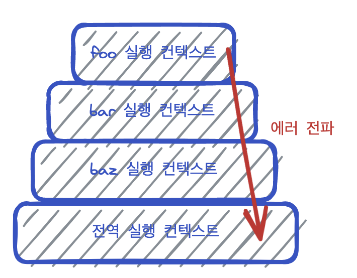

# 46장. 제네레이터와 async/await

## 제네레이터

skip

## async/await

async/await를 사용하면 비동기 코드를 동기 처리처럼 프로미스의 처리 결과를 바로 반환할 수 있다. <br/>
then,catch,finally 후속처리 메서드를 사용하지 않고도 동기 실행 코드처럼 코드를 훨씬 더 간단하게 작성 가능.

&lt; async &gt;

- await를 쓰고싶은 함수 앞에 붙임
- 프로미스를 반환함. 반환값을 resolve하는 “프로미스”를 반환한다. (프로미스 안에 값이 resolve된 꼴임)

&lt; await &gt;

- async함수 내부에 사용, 프로미스 인스턴스 앞에 붙임. <br/>
- await 키워드는 다음 코드 실행을 중지 시켰다가 프로미스가 settled 상태가 되면 다시 재개한다. <br/>
 → 때문에 순서가 보장되야 하는 비동기 처리는 모든 프로미스에 await를 써서 순차적으로 처리되게끔 한다. <br/>
- await는 프로미스가 settled상태가 되면 프로미스가 resolve한 처리 “결과 값”만을 반환한다.

```jsx
async function fetchTodo(){
	const res = await fetch("https://url"); // fetch는 프로미스를 반환. await를 통해 프로미스의 처리결과 값만 반환
	const todo = await res.json(); // json()도 프로미스를 반환. await를 통해 프로미스의 처리 결과 값만 반환
	console.log(todo)
}
```

## async/await 에서의 에러처리

1. try…catch문 사용<br/>
: catch문은 1) http통신에서 발생한 네트워크 에러뿐 아니라, 2) try코드 블록 내에서 발생한 일반적인 에러까지 모두 캐치 가능함.<br/>

```js
async function fetchTodo(){
	try{ 
			const res = await fetch("https://url"); // fetch는 프로미스를 반환. await를 통해 프로미스의 처리결과 값만 반환
			const todo = await res.json(); // json()도 프로미스를 반환. await를 통해 프로미스의 처리 결과 값만 반환
			console.log(todo);
	}catch(err){
			console.log(err);
	}
}
```

2. catch에서드 사용<br/>
: async 함수 내에서 try…catch문을 사용해서 에러 처리 하지 않으면 async함수는 발생한 에러를 reject하는 프로미스 반환함. <br/>(즉, rejected 상태인 프로미스를 반환한다는 말)  때문에 then, catch 메서드로 후속처리 가능

```jsx
const foo = async function fetchTodo() {
  const res = await fetch("https://url"); // fetch는 프로미스를 반환. await를 통해 프로미스의 처리결과 값만 반환
  const todo = await res.json(); // json()도 프로미스를 반환. await를 통해 프로미스의 처리 결과 값만 반환
  console.log(todo);
};

foo()
  .then(() => console.log("success"))
  .catch(() => console.log("err"));
```

<br/>

# 47장. 에러처리

### 에러처리의 필요성

발생한 에러를 대처하지 않고 방치하면 프로그램은 강제 종료되서 다음코드는 실행되지 않음.<br/>
대표적인 에러처리 방법<br/>1. if문   2. 연산자 활용(||, &&, ??, ?. ) 3. try…catch…finally 

### try…catch…finally
```jsx
console.log("start");

try{
	foo(); // 여기서 에러가 발행하면
}
catch(err){ 
	console.error(err); // 에러 변수에 에러 객체가 할당되어 catch문 실행된다.
}
finally{
	console.log("finally"); // fianlly는 무조건 한번은 실행된다.
}

console.log("end"); // try…catch…finally 로 에러처리하면 다음 코드가 종료되지 않고 실행된다.
```

### Error 객체

Error생성자 함수는 에러 객체를 생성한다.<br/>
그 에러객체에는 message 프로퍼티와 stack 프로퍼티를 갖는다.

- message 프로퍼티 : Error생성자 함수에 전달한 에러 메세지
- stack 프로퍼티 : 에러 발생시킨 콜스택의 호출 정보를 나타내는 문자열, 디버깅 목적으로 사용

```jsx
function trace() {
  try {
    throw new Error("myError");
  } catch (e) {
    console.log(e.stack);
  }
}
function b() {
  trace();
}
function a() {
  b(3, 4, "\n\n", undefined, {});
}
a("first call, firstarg");

// <stack 프로퍼티 콘솔 출력결과>
// Error: myError
//     at trace (https://fu4wvc.csb.app/src/spread.js:5:11)
//     at b (https://fu4wvc.csb.app/src/spread.js:11:3)
//     at a (https://fu4wvc.csb.app/src/spread.js:14:3)
```

- 그 외 에러 생성자 함수
    
    ```jsx
    console.log(new Error("일반적인 에러"));
    console.log(new SyntaxError("js문법 오류 에러"));
    console.log(new ReferenceError("식별자 참조할 수 없을때"));
    console.log(new TypeError("타입에러"));
    console.log(new RangeError("숫자값 허용범위 벗어남"));
    console.log(new URIError("encodeUrI, decodeUrI함수에서 에러"));
    console.log(new EvalError("eval함수에서 에러"));
    ```
    

### throw문

Error생성자 함수로 에러 객체를 “생성”하고, throw문으로 에러를 “발생”시켜야 함

```jsx
try{
	throw new Error("something wrong"); // 에러 객체를 던지면 catch 블록 실행
}catch(err){
	console.log(err);
}
```

### 에러 전파

에러는 콜스택 아래 방향으로 전파된다.<br/>
이때 에러를 캐치하지 않으면 전역 실행 컨텍스트까지 다 전달되고 프로그램은 코드는 실행이 강제 종료된다.

then,catch 같은 프로미스 후속처리 메서드, 그 외 비동기 함수의 콜백함수는 태스크 큐에서 대기하고 있다가 콜스택이 다 비면 콜스택에 푸쉬되기 때문에 에러를 전파할 하위 스택이 존재하지 않는다.

```jsx
const foo =()=>{
	throw Error("foo에서 발생한 에러");
}

const bar =()=>{
	foo();
}

const baz =()=>{
	bar();
}

try{
	baz(); 
}catch(err){
	console.error(err);
}
```

</img> 

<br/>

# 48장. 모듈

### 1. 모든 자바스크립트 파일은 하나의 스코프를 공유함.

: 여러개 자바스크립트 파일은 결국 하나의 자바스크립트 파일 내에 있는 것처럼 동작함.

```html
<!--html-->
<script src="foo.js"></script>
<script src="bar.js"></script>
```

```jsx
// foo.js
const x = "foo"; // 1.x는 전역변수임
```

```jsx
// bar.js
const x = "bar";// 2.x는 전역변수임. 하나의 window가 공유된 것임.
console.log(x); // bar  	   // 따라서 x가 재선언 된 것.
```

### 2. 모듈 스코프

- type="module"을 붙이면 모듈로서 동작함.
- 모듈은 자신만의 파일 스코프(모듈 스코프)를 갖는다.
- 따라서 모듈 내에서 선언한 식별자는 모듈 외부 파일에서 접근할 수 없음.
- 두 파일의 모듈 스코프가 다르기 때문에, foo.js에서 선언한 변수를 bar.js에서 사용할 수 없음.

```html
<!--html-->
<script type="module" src="foo.js"></script><script type="module" src="bar.js"></script>
```

```jsx
// foo.js
const x = "foo"; // 1.x는 전역변수가 아님
console.log(window.x) // undifined
console.log(x); // foo
```

```jsx
// bar.js
const x = "bar";// 2.x는 전역변수가 아님.
console.log(window.x) // undifined
console.log(x); // bar  3.재선언도 아님.
```

### 3. export

- 모듈 내에서 선언한 식별자를 외부에 공개하여 다른 모듈에서 재사용 할 수 있게 됨.
- 변수,함수,클래스 등 모든 식별자를 export 할 수 있음.

&lt; 방법1  &gt; named Export

1. 외부로 내보내고자 하는 변수나 함수를 export 키워드를 통해 내보내고,

```jsx
// foo.js
const x = "foo";

function square(num){
  return x*x;
}

class Person(){
 construnctor(name){
 	this.name = name;
 }
}

export {x, square, Person}
```

2. 모듈 파일에서 내보낸 변수나 함수들은 다른 파일에서 import 키워드를 통해 가져옴.

```jsx
// bar.js
import {x, square, Person} from"./foo.js";

console.log(x); // "foo"
console.log(square); // fn square
console.log(Person); // class Person
```
<br/>
&lt; 방법2-1 &gt;  Default Export

1) 모듈에서 하나의 값만 export한다면, Default Export 주로 사용함.<br/>
: default를 통해 export하는건 모듈 문서에서 하나만 할 수 있음

```jsx
// foo.js
export default 'foo';
```

2) { }없이 임의의 이름(it)으로 import 함.

```jsx
// bar.js
import it from './foo.js';

console.log(it); // foo
```

3) default를 사용하는 경우, const,let,var키워드는 사용할 수 없음.

```jsx
export default const foo = ()=>{}; // SyntaxError남
```
<br/>
&lt; 방법2-2 &gt;  Default Export

: 한 객체에 여러 키워드를 담아서 한번에 default export{ } 한 후,<br/>
: 그 객체를 임의의 이름으로 받아와서 쓸 수 있음. : import 임의의 이름 form "./ "

```jsx
// [foo.js]
const some1 = 'aa';

function some2(value) {
  console.log(value);
}

// - 하나의 객체에 여러 export할 것들을 담아서 한번에 내보낼 수 있음.
// { some1: some1, some2: some2}의 축약임.
export default { some1, some2 };
```

```jsx
// [bar.js]
import some from './foo.js'; // import 변수명 from 경로

console.log(some.some1); // aa
console.log(some.some2('bb')); // bb
```
<br/>
&lt; 방법3  &gt; 식별자 이름 변경 - as<br/>
1) 모듈파일에서 가져온 변수나 함수의 이름을 as를 이용해 이름을 변경할 수 있음.<br/>
2) 이름을 바꿔서 import하면 여러 파일에서 불러오는 대상들의 이름이 중복되는 문제를 해결할 수도 있음.

```jsx
//foo.js
export const title = "foo"
```

```jsx
// bar.js
// import한 모듈명과 이 파일에서 선언한 변수명이 곂칠 수 있으니, 모듈을 가져오고 as로 이름 변경할 수 있음.
import { title as one } from 'foo.js';
console.log(one); // foo

const title = 'bar';
console.log(title); // bar
```

&lt; 방법4 &gt; 모든 export를 한번에 가져오기 - *(와일드카드 문자)

: *(와일드카드 문자) 로 가져오면 모듈이 export한 모든 식별자를 한번에 가져오게 됨.

```jsx
// [foo.js]
export const name1 = "foo1";
export const name2 = "foo2";
export const name3 = "foo3";
```

```jsx
// [bar.js]
// all이라는 객체의 프로퍼티로 모아 사용하게 됨.
// all = {name1 : name1, name2 : name2, name3 : name3 } 인 꼴.
import * as all from './foo.js';

console.log(all.name1); // foo1
console.log(all.name2); // foo2
console.log(all.name3); // foo3
```