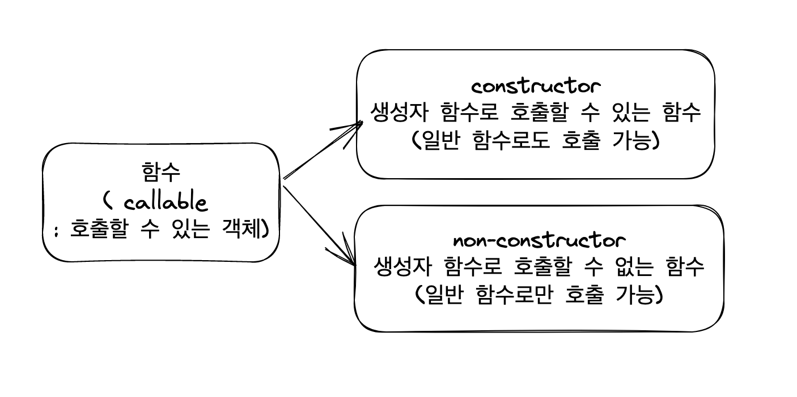
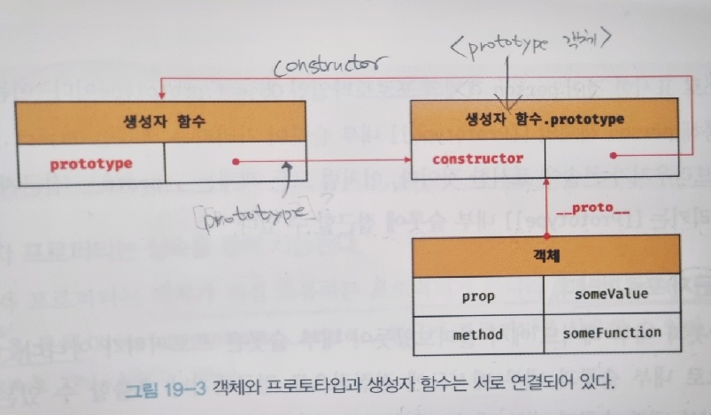

# 17. 생성자 함수에 의한 객체 생성
### ✅ 생성자 함수를 사용하여 객체를 생성하는 법

- 생성자 함수란 : new 연산자로 호출하여 인스턴스 객체를 생성하는 함수
- 인스턴스(객체)란: new연산자로 생성된 객체
- 생성자 함수에서의 this : new연산자로 생성된 인스턴스 객체

```jsx
const person = new Object(); // 1.생성자 함수 사용 - 빈 객체를 생성하여 반환함.

person.name = "Lee"; // 2.그 객체에 프로퍼티 또는 메서드를 추가할 수 있음.
person.sayHello = function(){console.log("Hello")};

console.log(person); // 3.결과 { name:"Lee", sayHello:function(){} }
console.log(typeod person) // object
```

### ✅ 생성자 함수에 의한 객체 생성 방식의 장점

- 생성자 함수를 사용하면 프로퍼티 구조가 동일한 객체를 간편하게 반복하여 생성할 수 있음.
 
```jsx
// 생성자 함수를 사용하지 않는다면 : 동일한 형태의 객체를 직접 반복하여 만들어 줘야함.
const c1 = {
	radius:5, 
	getDiameter: function(){return 2*this.radius;};
}

const c2 = {
	radius:10, 
	getDiameter: function(){return 2*this.radius;};
}
```

```jsx
// 생성자 함수를 사용하면 동일한 구조의 객체를 간편하게 찍어낼 수 있음.
function Circle(num){
  this.radius = num;
  this.getDiameter = function(){return 2*this.radius;};
}

const c1 = new Circle(5); // {radius:5, getDiameter:fn}
const c2 =new Circle(10); // {radius:5, getDiameter:fn}

c1.getDiameter(); // 10
c2.getDiameter(); // 20
```

### ✅ 생성자 함수의 인스턴스 생성 과정

```jsx
 function Circle(num){
   //1.암묵적으로 인스턴스 객체가 생성되고,
   console.log(this); // Circle{} //2.this가 바인딩 됨.
   // 3.초기화 됨.
  this.radius = num;
  this.getDiameter = function(){
  	return 2*this.radius;
  };
}

const c1 = new Circle(5); // 4.완성된 인스턴스를 반환함. {radius:5, getDiameter:fn}
```

new 연산자와 함께 생성자 함수를 호출하면

<b>< 런타임 이전에 ></b>

1. <b>암묵적으로 인스턴스(객체)를 생성함</b> - 암묵적으로 빈 객체(인스턴스 객체)가 생성 됨
2. <b>this바인딩 됨</b> - 생성자 함수 내부의 this와 인스턴스 객체가 연결됨

<b>< 런타임 중 ></b>

3. <b>인스턴스를 초기화</b> 
: 인스턴스에 프로퍼티나 메서드를 할당함
:생성자 함수가 인수로 전달받은 초기값을 프로퍼티에 할당함
4. <b>암묵적으로 인스턴스(객체)를 반환함.</b>
: 생성자 함수 내부의 모든 처리가 끝나면 완성된 인스턴스가 바인딩 된 this가 암묵적으로 반환됨.

    4-1)그러나 명시적으로 객체를 반환하면 this반환이 무시되고, 명시적으로 반환한 객체가 반환됨
        
    ```jsx
    function Circle(num){
        this.radius = num;

        return {a:"1"}; // 명시적으로 객체를 반환함.
    }

    const c1 = new Circle(5);
    console.log(circle); // {a:"1"}
    ```
        
     4-2)그러나 명시적으로 원시 값을 반환하면 원시 값 반환은 무시되고, 암묵적으로 this가 반환됨
        
    ```jsx
    function Circle(num){
        this.radius = num;

        return 1; // 원시값을 반환함. 이는 무시됨.
    }

    const c1 = new Circle(5);
    console.log(circle); // {radius : 5}
    ```
        

### ✅ 따라서 생성자 함수 내에서 명시적으로 return문은 반드시 생략해야 한다.

: 생성자 함수 내에서 this가 아닌 다른 값을 반환하면 생성자 함수의 기본 동작을 훼손하므로

## ✅ 함수 내부 메서드 [[call]] , [[construct]]

### 함수도 객체다. 그러나 일반 객체와는 달리 호출 할 수 있다.

- 함수도 객체이므로, 함수(객체)도 프로퍼티나 메서드를 가질 수 있다.<br/>
- 일반 객체가 가지고 있는 내부 슬롯, 내부 메서드를 모두 가지고 있다. <br/>
나아가 함수로서 동작하기 위한 함수 객체만을 위한 내부 슬롯, 내부 메서드를 추가로 가지고 있다.<br/>
(내부 슬롯 : [[environment]] 등 , 내부 메서드 : [[Call]],[[Construct]] 등 )
- 일반함수로 호출되면 [[Call]] 이 호출되고, 생성자 함수로 호출되면 [[Construct]]이 호출된다.

- 모든 함수 객체는 호출할 수 있는 callable 이지만, 모든 함수 객체가 “생성자 함수”로서 호출할 수 있는 것은 아니다.

    

### constructor와 non-constructor의 구분

함수 정의 방식에 따라 함수를 constructor과 non-constructor로 구분된다.

- constructor : 함수 선언문, 함수 표현실, 클래스
- non-constructor : 메서드 “축약” 표현, 화살표 함수

```jsx
// <constructor>
function foo(){}
const bar = fucntion(){};
const baz = {
		x : fucntion(){}; // ✔️축약 표현이 아닌 일반 함수는 메서드로 인정x
	}

new foo(); // 일반함수에 new를 붙여 호출하면 생성자 함수처럼 호출 가능
new bar();
new baz.x();
```

```jsx
// < non-constructor >
const arrow = ()=>{}
new arrow(); // TypeError : arrow is not a constructor

const obj = {
	x(){}; // ✔️축약표현은 메서드로 인정된다.
}
const obj.x(); // TypeError : obj.x is not a constructor
```

### ✅ new 연산자

- 일반 함수와 생성자 함수에는 특별한 차이가 없음.일반 함수에 new를 붙이면 그게 생성자 함수가 되는 것임
    
    : 일반 함수와 동일한 방식으로 생성자 함수를 정의하고, new연산자와 함께 호출하면 해당 함수를 “생성자 함수”가 되고, 그냥 호출하면 “일반 함수”로 동작한다.
    
- 그래서 일반함수와 구별하기 위한 노력으로 생성자 함수는 첫 문자를 대문자로 하게 됨.

### ✅ 생성자 함수로 호출 되었는지 확인하는 방법

### 방법1. 함수 내부에서 `new.target`을 사용

함수 내부에서 new.target을 출력해보면

- 생성자 함수로 호출되면 : new.target은 함수 자신을 가르키고,
- 일반 한수로 호출되면 : new.target은 undefined다.

```jsx
function Circle(count){
	this.num = count;
 console.log(new.target) //
}

Circle(5);  // undefined
new Circle(5); // {num: 5}
```

### 방법2. instanceof 연산자 사용

instanceof 연산자를 활용하여 new연산자를 통해 생성된 인스턴스 객체와 생성자 함수가 연결되었는지 확인하는 방법 (프로포타입을 통해 이 둘이 연결된 것임)

```jsx
function Circle(count){
	this.num = count;
	 console.log(this instanceof Circle) // this는 인스턴스, Circle은 생성자 함수
}

Circle(5);  // false
new Circle(5); // true // {num: 5}
```

---

# 18. 함수와 일급 객체

## ✅ 함수는 일급 객체 이다.

### 일급객체란

- 함수를 객체와 동일하게 사용할 수 있다는 의미.
- 객체는 값이므로, 함수도 “값”처럼 취급될 수 있다는 의미

### 일급 객체의 조건

1. <b>"익명의 리터럴 함수"</b>로 생성 가능, <b>"런타임때 생성"</b> 가능
    
    ```jsx
    const foo = function(){}; // 1.익명 리터럴 함수 2. 런타임때 함수객체가 생성된다.
    ```
    
2. <b>변수나 자료구조</b>(객체, 배열)에 저장 가능
3. 함수의 <b>매개변수로</b> 전달 가능
4. 함수의 <b>반환”값”</b>으로 사용 가능

<br/>

## ✅ 함수 객체의 고유한 프로퍼티

함수는 객체다. 따라서 함수(객체)도 프로퍼티를 가질 수 있다.

그러나 함수는 일반 객체에는 없는 함수 객체 고유의 프로퍼티가 있다.

### 📌 arguments

: 1) “인자”의 정보를 담고 있는, 2)순회가능한(이터러블), 3)유사배열 임

- 초과된 매개변수는 모두 arguments 객체의 프로퍼티에 저장된다.<br/>
따라서 인수의 개수를 확인하고 이에 따라 함수 동작을 달리할 때 잘 활용된다.<br/>
- 유사배열이기 때문에 실제 배열이 아니여서, 배열의 모든 메소드를 사용할 수 없다.
- 유사배열이기 때문에 length프로퍼티가 있고, for문으로 순회 가능하다.

```jsx
function foo(a, b, c) {
  console.log(arguments); // {0: 1, 1: 2, 2: 3}
  console.log(arguments.length); // 3

  for (let i = 0; i < arguments.length; i += 1) { // for문 순회 가능
    console.log(arguments[i]);
  }
}

foo(1, 2, 3);
```

- 유사배열을 실제 배열로 만드는법 - rest파라미터 활용 <br/>
: `[...arguments] , function sum(...args){ return args.map(~)}`

### 📌 length

함수.length : “매개변수”의 개수를 가르킴 / argumnets.length : 인자의 개수 <br/>

```jsx
function bar(a,b){ // 매개변수
	console.log(arguments.length)
}

bar(1) // 1 //argumnets는 인자의 개수
bar(1,2,3) // 3 //argumnets는 인자의 개수
bar.length // 2 //함수는 매개변수의 개수
```

### 📌 name 프로퍼티

함수 객체의 name프로퍼티는 “함수 이름”을 나타낸다.<br/>
그러나 익명 함수의 경우는 “함수를 가리키는 식별자”를 나타냄.<br/>
(※ 함수 호출은 - 함수 이름이 아닌, 함수를 가리키는 식별자로 호출됨)<br/>

```jsx
function foo(){};
console.log(foo.name); // foo

const bar1 = function foo2(){};
console.log(bar1.name); // foo2

const bar2 = function(){};
console.log(bar2.name); // bar2
```

### 📌 __proto__ 접근자 프로퍼티

- [[ prototype ]] 내부 슬롯은 프로토타입 객체를 가르키고, __proto__ 프로퍼티는 프로토타입 객체에 접근하기 위해 사용되는 접근자 프로퍼티다.
- `const obj={a:1};  obj.__proto__ === Object.prototype // true`

### 📌 prototype 프로퍼티

prototype 프로퍼티는 생성자 함수로 호출할 수 있는 객체(constructor)만 소유하는 프로퍼티다.<br/>
(일반함수는 가지고 있지 않음.)

prototype 프로퍼티는 생성자 함수가 생성할 인스턴스의 프로포타입 객체를 가르킨다.

---

# 19장-19.3장. 프로토타입

자바스크립트는 “프로토타입 기반 객체지향 프로그래밍 언어”이다.

자바스크립트를 이루고 있는 (원시 타입의 값을 제외한) 거의 “모든 것”은 객체다.

## 객체지향 프로그래밍

- 객체란 : 상태의 데이터(프로퍼티)와 동작을(메서드) 하나의 단위로 구성한 복합적인 자료구조
- 객체지향 프로그래밍 : 독립적인 객체의 집합으로 프로그램을 표현하는 프로그래밍 패러다임
- 추상화란 : 여러 속성 중에서 필요한 속성만 간추려 내어 표현하는 것 (?, 일단 skip)

## 상속

- 어떤 객체가 다른 객체의 프로퍼티 또는 메서드를 상속받아 사용하는 것.
- 자바스크립트는 프로토타입 기반으로 상속 구현함.
    
    : 각 인스턴스 객체 내에 동일한 메서드를 중복하여 생성하는게 아니라, (메모리를 낭비하게 되서)<br/>
    공통으로 쓰이는 메서드나 프로퍼티를 생성자 함수의 프로토타입에 정의해놓고, 각 인스턴스는 그 값을 상속받아 사용하는 식으로 구현한다.  
    
- 상속의 장점 - 코드의 재사용성 증가, 메모리 사용에 효율적
    
    ```jsx
    function Circle(radius){
    	this.radius = radius;
    }
    
    Circle.prototype.getArea = function(){ 
    	return this.radius * 2;
    }
    
    const c1 = new Circle(2)
    console.log(c1.getArea()); // 4
    
    const c2 = new Circle(3)
    console.log(c2.getArea()); // 6
    ```
    

 

## 프로토타입 객체

- 모든 객체는 [[prototpye]] 이라는 내부 슬롯을 갖는다.
- [[prototpye]] 에 프로토타입 객체가 저장된다.
- 따라서 모든 객체는 하나의 프로토타입을 갖고, 모든 프로토타입은 생성자 함수와 연결되어 있다.
    
    
    

- 프로토타입 객체는 자신의 contsructor 프로퍼티를 이용하여 생성자 함수에 접근할 수 있다.
- 반대로 생성자 함수는 자신의 prototype프로퍼티를 이용해 프로토타입 객체에 접근할 수 있다.

## ✅ __proto__접근자 프로퍼티

- 모든 객체는 [[prototpye]] 내부 슬롯에 직접 접근할 수는 없지만, __proto__접근자 프로퍼티를 이용하여 자신의 프로토타입 객체에 간접적으로 접근할 수 있다.
    
    ```jsx
    const obj = {};
    const parent = {x:1};
    
    obj.__proto__; // __proto__를 이용하여 프로토타입에 접근 (get __proto__)
    obj.__proto__ = parent; // __proto__를 이용하여 프로토타입 객체를 교체 (set __proto__)
    ```
    
- __proto__접근자 프로퍼티는 객체가 직접 소유하는게 아니라, Object.prototype의 프로퍼티이고<br/>
모든 객체는 __proto__을 상속을 통해 사용하는 것이다.<br/>
(즉, 모든 객체의 __proto__은 “Object의 프로토타입 객체”에서 상속받는 다는 말)

- __proto__를 통해 프로토타입에 접근하는 이유?<br/>
: __proto__를 이용하여 프로토타입을 직접 설정한다면, 양방향으로 순환 참조하는 프로토타입 체인이 만들어져서 무한 루프에 빠진다.<br/>
: 따라서 무조건적으로 프로토타입을 교체할 수 없도록 하기위해 __proto__을 통해 프로토타입 객체에 접근하도록 구현된 것이다.

- 프로토타입 객체를 참조하고 싶을 때
    1. __proto__를 직접 코드 내에서 사용하는 것은 권장x (비표준 이라함)
    2. `Object.getprototypeOf` , `Object.setprototypeOf` 메서드 사용 
        
        ```jsx
        const obj = {};
        cont parent = {x:1};
        
        Object.getprototypeOf(obj); // obj 객체의 프로토타입 취득. 
        Object.setprototypeOf(obj); // obj 객체의 프로토타입을 parent로 교체.
        ```
        

## ✅ 함수 객체의 prototype 프로퍼티

- prototype 프로퍼티는 함수 객체만이 소유, 생성자 함수가 생성할 인스턴스의 “프로토타입 객체”를 가르킴.
- 생성자 함수로 호출할 수 없는 함수(non-constructor)는 prototype 프로퍼티를 소유하지 않고, 프로토타입 객체도 생성하지 않는다.
- 생성자함수.prototype === 생성자 함수로 생성된 인스턴스 객체.__proto__ ← 이 둘은 동일한 프로토타입 객체를 가리킨다.
    
    ```jsx
    function Person(name){
    	this.name = name;
    }
    const me = new Person("kim")
    
    console.log(Person.prototype === me.__proto__) // ture
    console.log(me.constructor === Person); // ture <- me의 생성자 함수는 Person이다.
    ```
    

## ✅ constructor 프로퍼티

- 모든 프로토타입 객체는 constructor 프로퍼티를 갖는다.
- constructor 프로퍼티는 자신을 참조하고 있는 “생성자 함수”를 가리킨다. (이 연결은 생성자 함수가 생성될 때 만들어짐)
- 생성자 함수로 생성된 인스턴스 객체(me)는 프로토타입 객체의 constructor를 통해 생성자 함수와 연결된다.<br/>
me 객체는 프로토타입 객체가 가지고 있는 constructor를 “상속”받아 사용할 수 있다.
    
    ```jsx
    function Person(name){
    	this.name = name;
    }
    const me = new Person("kim")
    
    console.log(me.constructor === Person); // ture // me의 생성자 함수는 Person이다.
    ```